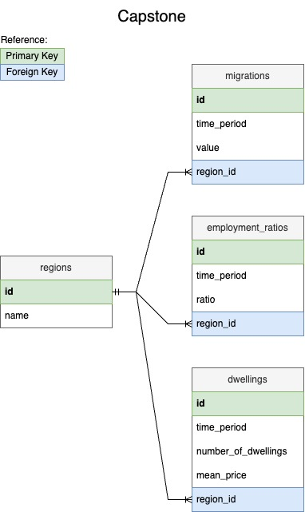
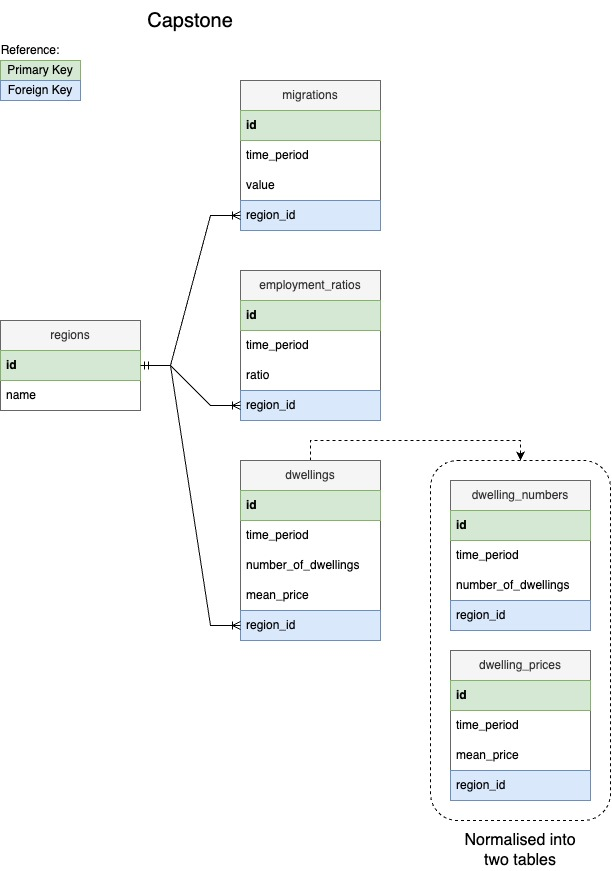
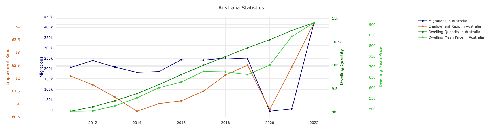
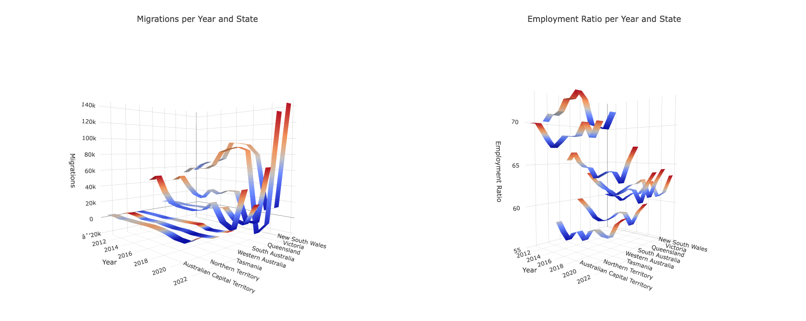
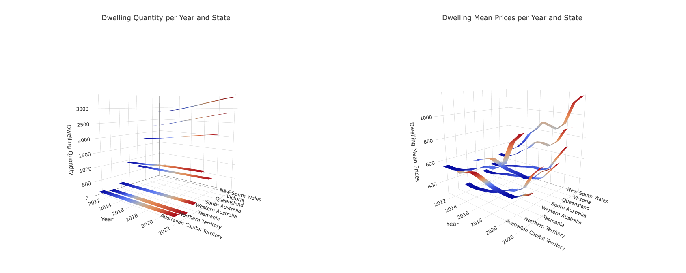

# Capstone Project

## Identifying the Data Source

For this Python for Everybody capstone project I selected data provided by the
Australian Bureau of Statistics about the following areas:

- [Overseas Migration](https://www.abs.gov.au/statistics/people/population/overseas-migration/2022-23-financial-year)
- [Labour Force](https://www.abs.gov.au/statistics/labour/employment-and-unemployment/labour-force-australia/nov-2023)
- [Housing Occupancy and Costs](https://www.abs.gov.au/statistics/people/housing/housing-occupancy-and-costs/2019-20)
- [Total Value of Dwellings](https://www.abs.gov.au/statistics/economy/price-indexes-and-inflation/total-value-dwellings/latest-release#:~:text=The%20number%20of%20residential%20dwellings%20in%20Australia%20rose%20by%2052%2C300,%2419%2C200%20to%20%24925%2C400%20this%20quarter.)

Most of the data is available in MS Excel format, which made me think it would
be somewhat straightforward to work with.

Recent news and forum discussions regarding the influence of international
migration on Australia's job and housing markets have piqued my curiosity, so I
was keen on analysing data to uncover potential correlations that may connect
international migration with trends in these markets.

As an international migrant myself, I am personally invested in understanding
how Australia's migration policies and the influx of immigrants impact the
country's economy.

I intended to perform the following analysis with this data:

- **Database Integration:** Import the data into a database for efficient
  querying and analysis.
- **Visualization:** Generate maps, charts, and graphs to represent migration
  and economic data.
- **Economic Impact Analysis:** Understand the economic impact of migration on
  housing and job markets.
- **Correlation Analysis:** Identify potential correlations between migration,
  labour force, and housing data.

## Analysing a Data Source

Upon further investigation, I discovered that the data is available through an
API provided by the Australian Bureau of Statistics. This makes it easier to
fetch the data with Python, integrate it into a database, and then perform
analysis. The API provides an XML response.

After trying to build an API request on my own, I discovered that the Australian
Bureau of Statistics provides a tool to explore data,
[Stat Data Explorer](https://explore.data.abs.gov.au/). What's cool about this
tool is that it allows a visual inspection of the data and generates the
corresponding API request for the selected data.

I decided to not use the data I initially identified in MS Excel files and use
this tool to select the most interesting data sets for my intended analysis:

- Net Overseas Migration (per state)

  - Dataset: Net overseas migration, Arrivals, departures and net,
    State/territory, Age and sex - Calendar years, 2004 onwards
  - Measure: Net Overseas Migration
  - Age: All ages
  - Sex: Persons (no sex disaggregation)
  - Region: Australia and Australian states
  - Frequency: Annual
  - Unit of measure: Number
  - Data visualisation:
    ```
    https://explore.data.abs.gov.au/vis?tm=Migration&pg=0&df[ds]=ABS_ABS_TOPICS&df[id]=NOM_CY&df[ag]=ABS&df[vs]=1.0.0&pd=2004%2C&dq=3.TOT.3..A&ly[cl]=TIME_PERIOD
    ```
  - API request:
    ```
    https://api.data.abs.gov.au/data/ABS,NOM_CY,1.0.0/3.TOT.3..A?startPeriod=2004
    ```

- Employment to population ratio (per state)

  - Dataset: Labour Force
  - Measure: Employment to population ratio
  - Sex: Persons (no sex disaggregation)
  - Age: Total (age)
  - Adjustment Type: Seasonally Adjusted
  - Region: Australia and Australian states
  - Frequency: Monthly
  - Unit of measure: Percent
  - Data visualisation:
    ```
    https://explore.data.abs.gov.au/vis?tm=employment%20to%20population%20ratio&pg=0&df[ds]=LABOUR_TOPICS&df[id]=LF&df[ag]=ABS&df[vs]=1.0.0&pd=2004-01%2C2023-11&dq=M16.3.1599.20..M&ly[cl]=TIME_PERIOD&hc[Measure]=Employment%20to%20population%20ratio&fs[0]=Labour%2C0%7CEmployment%20and%20unemployment%23EMPLOYMENT_UNEMPLOYMENT%23&fc=Labour
    ```
  - API request:
    ```
    https://api.data.abs.gov.au/data/ABS,LF,1.0.0/M16.3.1599.20..M?startPeriod=2004-01&endPeriod=2023-11
    ```
  - [Information about the Employment to Population Ratio](https://www.investopedia.com/terms/e/employment_to_population_ratio.asp)

- Number of residential dwellings and Mean price of residential dwellings (per
  state)
  - Dataset: Residential Dwellings: Values, Mean Price and Number by State and
    Territories
  - Region: Australia and Australian states
  - Frequency: Quarterly
  - Measure: Number of residential dwellings
    - Unit of measure: Number, Thousands
  - Measure: Mean price of residential dwellings
    - Unit of measure: Australian Dollars, Thousands
  - Data visualisation:
    ```
    https://explore.data.abs.gov.au/vis?tm=Dwellings&pg=0&df[ds]=ECONOMY_TOPICS&df[id]=RES_DWELL_ST&df[ag]=ABS&df[vs]=1.0.0&pd=2011-Q3%2C2023-Q3&dq=5%2B4..Q&ly[rw]=TIME_PERIOD&ly[rs]=MEASURE
    ```
    - API request:
    ```
    https://api.data.abs.gov.au/data/ABS,RES_DWELL_ST,1.0.0/5+4..Q?startPeriod=2011-Q3&endPeriod=2023-Q3
    ```

As the data contained different measures and frequencies, some cleanup and
normalisation was required to analyse it correctly.

## Building a data fetching script

I started by building the Python script (`data_getter.py`) to get the data from
the Australian Bureau of Statistics API endpoints. As the data is available in
XML format, I used the `xml.etree.ElementTree` module to parse the XML response.

I decided to consider the period from 2011 to 2022 for the analysis. This is
because the data for the number of residential dwellings is only available from
2011 onwards, and there is no migration data for 2023 yet.

Once the XML data was parsed, I inserted it into a SQLite database
(`capstone.sqlite`). I decided to use SQLite because it is lightweight and easy
to use (and the database that we have been using throughout the course).



> You can test this script by running `python3 data_getter.py` in your terminal.

## Building a data normalisation script

After fetching the data, I noticed that the data was not normalised. For
example, the number of residential dwellings is available in quarters, while the
employment ratio is available in months. I decided to normalise the data to
years, as is the case with migrations data.

I built another Python script (`data_normaliser.py`) to normalise the data. This
script also performs a data insertion into a "clean" database
(`capstone_normalised.sqlite`). This database will be used for the analysis and
visualisation of the data.



> You can test this script by running `python3 data_normaliser.py` in your
> terminal.

## Data Statistics

Once the data was normalised, I could start performing some analysis and
visualization.

I started by getting basic statistics about the data. In order to accomplish
this, I built a Python script (`data_stats.py`) that delivered the following
statistics:

- Migration
  - Year with highest migration
  - Year with lowest migration
  - Average Migration per year
  - Average Migration per state
- Employment ratio
  - Year with highest employment ratio
  - Year with lowest employment ratio
  - Average employment ratio per year
  - Average employment ratio per state
- Dwellings (quantity)
  - Year with highest dwellings number
  - Year with lowest dwellings number
  - Average dwellings number per year
- Dwellings (price)
  - Year with highest dwelling price
  - Year with lowest dwelling price
  - Average dwelling price per year

> You can test this script by running `python3 data_stats.py` in your terminal.

This is an example of the output of the script:

```
➜  capstone_project git:(main) ✗ python3 data_stats.py
Getting migration data from database...

    == ---------------------------------------- ==
       Migration statistics
    == ---------------------------------------- ==
    Highest Migration year was 2022 with 422,230 migrations.
    Lowest Migration year was 2020 with -20,370 migrations.
        The Migration variation between the highest and lowest year is about 20.73 times the lowest year.
    Average Migration per year is 45,061 migrations.
    Average Migration per state is:
        New South Wales: 70,884 migrations
        Victoria: 61,682 migrations
        Queensland: 29,642 migrations
        South Australia: 11,857 migrations
        Western Australia: 21,871 migrations
        Tasmania: 2,165 migrations
        Northern Territory: 1,685 migrations
        Australian Capital Territory: 2,979 migrations
        Australia: 202,784 migrations

Getting employment ratios data from database...

    == ---------------------------------------- ==
       Employment Ratio statistics
    == ---------------------------------------- ==
    Highest Employment Ratio year was 2017 with 73 %.
    Lowest Employment Ratio year was 2013 with 55 %.
        The Employment Ratio variation between the highest and lowest year is about 1.33 times the lowest year.
    Average Employment Ratio per year is 62 %.
    Average Employment Ratio per state is:
        New South Wales: 60 %
        Victoria: 61 %
        Queensland: 61 %
        South Australia: 58 %
        Western Australia: 64 %
        Tasmania: 56 %
        Northern Territory: 70 %
        Australian Capital Territory: 68 %
        Australia: 61 %

Getting dwelling numbers data from database...

    == ---------------------------------------- ==
       Dwelling Number statistics
    == ---------------------------------------- ==
    Highest Dwelling Number year was 2022 with 10,907 (x1000) dwellings.
    Lowest Dwelling Number year was 2011 with 74 (x1000) dwellings.
        The Dwelling Number variation between the highest and lowest year is about 147.39 times the lowest year.
    Average Dwelling Number per year is 2,201 (x1000) dwellings.
    Average Dwelling Number per state is:
        New South Wales: 3,080 (x1000) dwellings
        Victoria: 2,545 (x1000) dwellings
        Queensland: 1,976 (x1000) dwellings
        South Australia: 764 (x1000) dwellings
        Western Australia: 1,049 (x1000) dwellings
        Tasmania: 241 (x1000) dwellings
        Northern Territory: 81 (x1000) dwellings
        Australian Capital Territory: 166 (x1000) dwellings
        Australia: 9,909 (x1000) dwellings

Getting dwelling prices data from database...

    == ---------------------------------------- ==
       Dwelling Mean Prices statistics
    == ---------------------------------------- ==
    Highest Dwelling Mean Prices year was 2022 with 1,170 (x1000) AUD.
    Lowest Dwelling Mean Prices year was 2012 with 297 (x1000) AUD.
        The Dwelling Mean Prices variation between the highest and lowest year is about 3.94 times the lowest year.
    Average Dwelling Mean Prices per year is 576 (x1000) AUD.
    Average Dwelling Mean Prices per state is:
        New South Wales: 810 (x1000) AUD
        Victoria: 671 (x1000) AUD
        Queensland: 514 (x1000) AUD
        South Australia: 453 (x1000) AUD
        Western Australia: 551 (x1000) AUD
        Tasmania: 401 (x1000) AUD
        Northern Territory: 473 (x1000) AUD
        Australian Capital Territory: 671 (x1000) AUD
        Australia: 645 (x1000) AUD
```

## Data Visualization

Next, I built a Python script (`data_visualiser.py`) to generate the following
visualisations:

- a 2D chart comparing the data dimensions at a national level,
- four 3D charts comparing the data dimensions among Australia's states.

I initially tried using the `3d.js` library to generate the charts, but I had to
plot multiple data dimensions in the same chart, and I could not find a clean
way to do it with this library. I then decided to use the `plotly.js` library,
which allowed me to plot multiple data dimensions in the same chart in a very
straightforward way.

I created a main chart focusing on Migration, Employment Ratio, Dwelling
Quantity, and Mean Price at a national level. This allowed me to analyze how
these variables correlated and spot trends. Of course, correlation in this chart
does not necessarily mean causation, as there are more factors to consider for a
proper analysis. Still, for the sake of this project, the plotted data should
suffice.



I found that 2020 was the year with fewer migrations (post-COVID-19 year),
correlating with a significant drop in the Employment Ratio, indicating more
people were unemployed. This drop in Employment Ratio is likely due to the
impact of the pandemic on the job market rather than the sharp drop in
migration. The dwelling quantity (the number of available residencies) remained
in steady growth, while the mean dwelling price began to drop as it
approached 2020. In 2021 and 2022, once migration spiked again (due to Australia
reopening its borders), the Employment Ratio and mean dwelling price also
spiked. However, the dwelling quantity did not undergo any alteration in its
steady growth. The fact that in 2021 and 2022 more migrants arrived in
Australia, and the number of dwellings remained unaltered in its tendency, may
explain the sharp increase in mean dwelling prices (indicating more demand for
houses). The Employment Ratio improved as migration increased, suggesting that
migration did not have a negative impact on employment.

I also plotted four other 3D charts comparing the dimensions of Migration,
Employment Ratio, Dwelling Quantity, and Mean Price among Australia's states.
Several conclusions can be drawn from these charts, such as migrants preferring
the states of New South Wales and Victoria to migrate to and how these states
are driving the rise in Dwelling Quantity, the not-so-sharp increase in dwelling
prices for the Northern Territory, and the good health of the employment market
in the Northern Territory as well.





Using a 2D line chart to compare the data dimensions at a national level helped
to spot trends and correlations, which was the original idea after the first
contact with the data. Using 3D graphs to compare different states was a great
tool to dive into the comparison of the data dimensions across states in a
dynamic and engaging way. The experience gained from working on this project
will undoubtedly benefit me in the future. It provided an opportunity to apply
and enhance my skills in Python, SQL databases, data analysis, visualization,
and interpretation. Navigating through real-world data, although challenging at
times, has improved my problem-solving abilities. Overall, this project has been
a valuable learning experience that will contribute to my growth as a software
engineer.

> You can generate these charts by running `python3 data_visualiser.py` in your
> terminal and then opening the `charts.htm` file in your browser. The raw data
> for the charts can be found in the `charts.js` file.

## Final Thoughts about the Capstone Project and the Course

The experience gained from working on this project will undoubtedly benefit me
in the future. It provided an opportunity to apply and enhance my skills in
Python, SQL databases, data analysis, visualization, and interpretation.
Navigating through real-world data, although challenging at times, has improved
my problem-solving abilities. Overall, this project has been a valuable learning
experience that will contribute to my growth as a software engineer.
